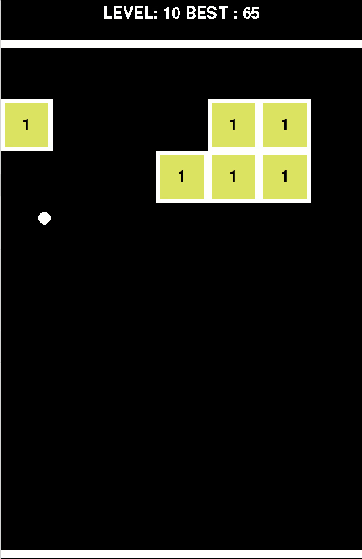

# brick-blast-ball-RL

A simplified copy of the Mobile game "Brick Blast Ball" using PyGame + RL agent that can be trained on it.

Linear Function Sarsa Agent training.



## How simplified is this version?

A lot! (Even though with small changes you can make a full version of the game)

* Blocks contain only 1 value (instead of an increasing value).
* Only 1 ball available at a time (instead of multiple balls at a time).
* Each space in a row has probability of 0.5 of having a block (unkown probability used in the original game). 

Why? The idea was to make it as simple as we can in order to train an agent.
Even with all these simplifications there are 2^56 (72057594037927936) possible states.

## How to run this?

### Play the game

```shell
python game.py
```

### Train the agent

```shell
python agent.py
```

# What you'll find here

- [x] Basic Game Environment
- [x] Linear Function Sarsa Agent
- [ ] Actor-Critic Agent (or some other agent that considers a continuous space of actions)
- [ ] Make improvements in order to train faster.

> OBS: This game was made only for learning purposes and is not related to Brick Blast Ball in anyway.
